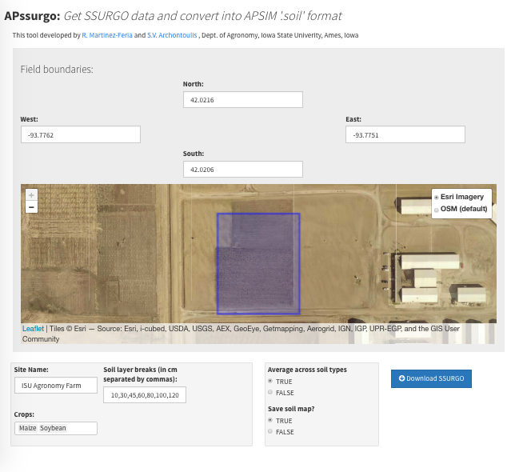

# APssurgo

This repo contains R code for downloading soils data from [SSURGO database](https://websoilsurvey.nrcs.usda.gov) and converting it into [APSIM](https://www.apsim.info/) format. All the code is wrapped in a easy-to-use [shiny app](https://shiny.rstudio.com/). Run the `app.R` file using R studio,  add the needed inputs and click on the "download SSURGO" button.  



## Warning

Note that data from SSURGO at field scale is essentially unreliable and should be used with caution when setting up the APSIM model. Rather, SSURGO data should be used as "starting-point" and verified against field measurements when available. 

## About the code 

The code behind the tool relies heavily on the [FedData](https://cran.r-project.org/web/packages/FedData/index.html) package. APSIM parameter set estimation follows the approach described by [Archontoulis et al. (2014, Agron. J. 106(3):1025-1040)](https://dl.sciencesocieties.org/publications/aj/abstracts/106/3/1025?access=0&view=pdf).

Before using this tool, make sure you have installed the following packages:

```{r}
install.packages(c("shiny","leaflet","shinythemes","FedData","maps",
                   "maptools","rgdal","raster","dplyr","ggplot2","XML",
                   "Hmisc","lubridate"))
```
## Data inputs

* Site name: Unique name to label downloaded data
* Field extent: North and South as latitude, East and West as longitude.
* Soil layers: User-defined, in centimeters
* Crop(s) to be simulated: Needed for definition of soil-crop parameters (e.g. crop_LL, XF)

## Outputs

* Downloaded SSURGO spatial data files are saved into `.zip` files in a local subdirectory `/RAW`
* Extracted SSURGO tables are saved into a local subdirectory `/EXTRACTIONS/SITE_NAME`
* APSIM-compatible file is saved as `SITE_NAME.xml`. This can be read in the APSIM UI using the [toolbox option](https://www.apsim.info/Documentation/CommonTasksinAPSIM/CreateyourownorAddsomeoneelsestoolbox.aspx).

## Options

* Average across soil types: if `TRUE`, then returns only one soil, representing the weighted avergage across all soil types. If `FALSE`, returns all soils
* Save soil map: if `TRUE` then `.shp` and `.jpg` files of the downloaded soils are saved in the working directory

## Contact

* Questions about the code and methodology: [Rafael Martinez-Feria](mailto:rmartine@iastate.edu), Dep. of Agronomy, Iowa State University
* Questions about methodology and collaborations:[Sotirios Archontoulis](mailto:sarchont@iastate.edu), Dep. of Agronomy, Iowa State University 
